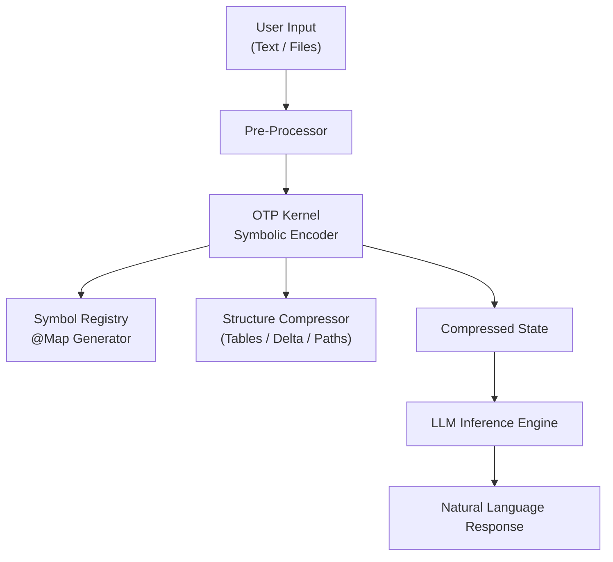

# Origami Thought Protocol (OTP)

[](https://github.com/N3E6X/The-Origami-Thought-Protocol/blob/main/LICENSE)
[](https://www.python.org/downloads/)
[](https://ai.google.dev/)

> **A deterministic semantic compression engine for maximizing context window entropy and enforcing logical state recoverability.**

---

## 📑 Abstract

**Origami Thought Protocol (OTP)** introduces a **symbolic memory layer** designed to overcome the architectural limits of modern LLMs. Instead of re-feeding raw text or summaries, OTP encodes conversational state, goals, constraints, and decisions into a compact, machine-native semantic representation.

By shifting from "text-in, text-out" pipelines to **structured thought-state compression**, OTP enables:

*   **Near-infinite context** at a fraction of the token cost.
*   **Deterministic long-term reasoning** through durable symbolic state.
*   **Auditable, inspectable memory** for compliance and safety-critical environments.
*   **Multi-agent and multi-tool interoperability** through shared state schemas.
*   **Scalable deployment** on edge devices and low-resource hardware.

> **OTP is not a summarizer;** it is a protocol layer for cognitive efficiencya foundation that lets any LLM operate with persistent memory, lower latency, and greater architectural stability.

> **Note:** This implementation is a simple working application I built to demonstrate how OTP can be used in practice. It is not a full production system  it’s a minimal, functional example that shows the core idea in action.

---

## 💡 Insights

### 1. LLMs Don’t Forget Because They’re “Dumb”  They Forget Because Context Is Text
Large models aren’t limited by intelligence; they are limited by **input modality**. When all memory is encoded as unstructured human language, the model must reprocess massive amounts of redundant text at every step. **OTP reframes memory as structured state, not prose**  eliminating the bottleneck.

### 2. Summaries Reduce Token Count, but They Also Reduce Precision
Traditional summarization introduces ambiguity, loses constraints, and collapses fine-grained decisions. OTP keeps **100% recoverability** by encoding meaning as symbolic logic rather than lossy text compression. This transforms memory from “blurry recall” into **deterministic reasoning state**.

### 3. Real Long-Term Reasoning Requires Stability, Not Bigger Models
Scaling models only buys longer attention spans  not structured continuity. OTP provides the missing layer: a durable **cognitive skeleton** that persists across steps, sessions, and tools.

### 4. Symbolic Memory Makes Multi-Agent Systems Actually Work
Most agent architectures collapse because agents pass around giant blobs of text. OTP turns agent state into **compact, typed symbols** that all agents can read/write. This creates a shared cognitive substrate.

### 5. Token Costs Shape System Architecture
High token costs force developers to truncate history and prune context. OTP changes the economics: **stateful AI becomes cheaper than stateless AI**, unlocking new categories of applications.

### 6. Auditable AI Requires Structure, Not More Logging
Raw conversation logs are unstructured and opaque. OTP outputs directly analyzable state, giving enterprises explainability, policy verification, and deterministic replays.

### 7. Small Models Become “Bigger” When Given the Right State
Symbolic state can give compact or edge models the illusion of large-context reasoning. OTP becomes a **force multiplier**.

---

## 📊 Example: Context & Reasoning Efficiency

The table below compares a standard RAG retrieval, a compressed context method (LongLLMLingua), and the Origami Thought Protocol (OTP).


| Method | Prompt Context | Tokens | Response |
| :--- | :--- | :--- | :--- |
| **Original** | Write a high-quality answer for the given question using only the provided search results (some of which might be irrelevant).<br><br>......<br>Document [2](Title: OPEC) of "the top 100 most influential people in the shipping industry". However, the influence of OPEC on international trade is periodically challenged by the expansion of non-OPEC energy sources, and by the recurring temptation for individual OPEC countries to exceed production targets and pursue conflicting self-interests. As of June 2018, OPEC has 15 member countries: six in the Middle East (Western Asia), seven in Africa, and two in South America. According to the U.S. Energy Information Administration (EIA), OPEC\'s combined rate of oil production (including gas condensate) represented 44 percent of the world\'s total in 2016, and OPEC accounted for<br>......<br>Document [10](Title: OPEC) Organization of the Petroleum Exporting Countries (OPEC, /ˈoʊpɛk/ OH-pek, or OPEP in several other languages) is an intergovernmental organization of 14 nations as of February 2018, founded in 1960 in Baghdad by the first five members (Iran, Iraq, Kuwait, Saudi Arabia, and Venezuela), and headquartered since 1965 in Vienna, Austria. As of 2016, the 14 countries accounted for an estimated 44 percent of global oil production and 73 percent of the world\'s "proven" oil reserves, giving OPEC a major influence on global oil prices that were previously determined by American-dominated multinational oil companies.<br>......<br><br>Question: how many countries are a part of opec in may 2018 ? | 347 | **15 (Wrong)**<br>*(Hallucinated based on the June data)* |
| **LongLLMLingua** | Write a high-quality answer for the given question using only the provided search results (some of which might be irrelevant).<br><br>[5Title: OPEC OPE its two newest, who had joined mid1970s. Ecuador withdrew in December 1992 it was unwilling pay US$2 million membership fee and felt that it needed to produce more it was allowed under the OPEC quota, although rejoined in October 2007. Similar concerns prompted Gabon to suspend membership in January 1995; it rejoined in July 2016 Iraq remained a member of OPEC since the organization\'s founding, Ira production was a part of OPEC quota agreements from 1998 to 216, due to the country\'s daunting political difficulties.<br>1 the Petroleum Exporting Countries (OPEC, /ˈoʊpɛk/ OH-pek, or OPEP in several other languages) is an intergovernmental organization of 14 nations as of February 2018, founded in 1960 in Baghdad by the first five members (Iran, Iraq, Kuwait, Saudi Arabia, and Venezuela), and headquartered since 1965 in Vienna, Austria. As of 2016, the 14 countries accounted for an estimated 44 percent of global oil production and 73 percent of the world\'s "proven" oil reserves, giving OPEC a major influence on global oil prices that were previously determined by American-dominated multinational oil companies.<br><br>Question: how many countries are a part of opec in may 2018 | 311 | **14 (Right)** |
| **OTP** | `@Map{O=OPEC,M=Member,D=Doc,P=Prod,W=World,I=Infl,C=Count};Task:Ans(Q,Src);Src:{D2(O):I~Chlg(NonO\|SelfInt);Jun18:15M(6ME,7Af,2SA);EIA16:P=44%W\|D10(O):Org(14M@Feb18);Fnd60(5M);HQ65;16:14M=(44%P\|73%Res)>I(Price)};Q:C(O)@May18?` | **122** | **14 (Right)**<br>*(Highest accuracy, lowest cost)* |
---

## 🛠️ Architecture


---

## 💻 Installation & Usage

OTP is implemented as a Python-based CLI wrapper around the Google GenAI SDK.

### Prerequisites
*   Python 3.10+
*   `google-genai` package
*   Google Gemini API Key

### Quick Start

1.  **Clone and Install:**
    ```bash
    git clone https://github.com/N3E6X/The-Origami-Thought-Protocol.git
    cd The-Origami-Thought-Protocol
    pip install -U google-genai
    ```

2.  **Execute Kernel:**
    ```bash
    python main.py
    ```
---


© 2025 Origami Thought Protocol.
