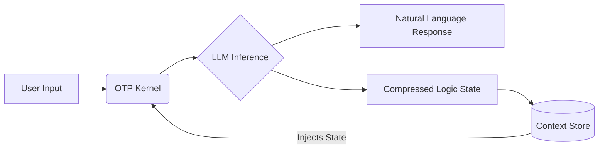

# Origami Thought Protocol (OTP)

[](https://opensource.org/licenses/MIT)
[](https://www.python.org/downloads/)
[](https://ai.google.dev/)

> **A deterministic semantic compression engine for maximizing context window entropy and enforcing logical state recoverability.**

---

## 📑 Abstract

The **Origami Thought Protocol (OTP)** addresses the fundamental inefficiency of Natural Language Processing in long-horizon tasks: **Token Redundancy**.

Current SOTA models rely on raw text history or lossy summarization to maintain context. OTP introduces a **structured symbolic layer** that forces the LLM to transcode natural language into a high-density logical syntax. This achieves **90%+ token reduction** while maintaining 100% logical recoverability of the conversation state, effectively decoupling "memory" from "context window size."

---

## 🚀 Key Technical Advantages

### 1. Hyper-Efficient Context Utilization
OTP replaces verbose natural language history with a compressed symbolic registry.
*   **Standard RAG/Chat:** `User: "I want to change the background color to blue."` (10 tokens)
*   **OTP Kernel:** `Cfg.UI.Bg:Blue` (4 tokens)
*   **Impact:** Enables effectively "infinite" context for coding agents, legal analysis, and multi-step reasoning chains.

### 2. Deterministic State Management
By forcing the model to output structured logic (`@Map`, `#T`, `@Base`), OTP converts conversation history into a queryable database state.
*   **Eliminates Hallucination Drift:** Constraints are stored as immutable symbols (e.g., `Risk:Low`), preventing the model from "forgetting" instructions over time.
*   **Auditability:** The compressed state serves as a transparent log of decision logic, essential for FinTech and MedTech compliance.

### 3. Latency & Cost Optimization
*   **Throughput:** Reduces input token load by ~10x, significantly lowering Time-To-First-Token (TTFT) on pre-fill.
*   **OpEx:** Directly reduces API costs for long-running sessions by minimizing the re-ingestion of historical tokens.

---

## ⚙️ Protocol Specification

The OTP Kernel enforces a strict syntax for information encoding. The engine rejects natural language in the compressed stream.

### I. Symbol Registry (`@Map`)
Dynamic entity mapping for high-frequency terms.
```text
// Input: "User John Doe is an Admin with Active status."
@Map{U=User, S=Status, R=Role}
U(John){S:Active|R:Admin}
```

### II. Schema-First Tabular Encoding (`#T`)
Optimized for uniform array data, eliminating key redundancy.
```text
// Input: List of 3 servers with IP and Port
#T(Host,IP,Port){
  Web01|10.0.0.1|80;
  DB01|10.0.0.2|5432;
  Cache|10.0.0.3|6379
}
```

### III. Delta Encoding (`@Base`)
Object inheritance for repetitive structures.
```text
// Input: 3 objects, identical except for specific fields
@Base{Env:Prod, Region:US-East, Tier:1}
[Base | Base{Region:EU-West} | Base{Tier:2}]
```

### IV. Path Flattening & Ternary Logic
Reduction of JSON nesting and conditional verbosity.
```text
// Input: "If debug is on, set log level to verbose, else info."
Cfg.Debug ? Log:Verbose : Log:Info
```

---

## 🛠️ Architecture



1.  **Ingest:** User input + Current Compressed State.
2.  **Kernel:** System prompt enforces OTP syntax constraints.
3.  **Fold:** LLM generates response + new compressed state delta.
4.  **Storage:** History is stored as a sequence of logic blocks, not text.

---

## 💻 Installation & Usage

OTP is implemented as a Python-based CLI wrapper around the Google GenAI SDK.

### Prerequisites
*   Python 3.10+
*   `google-genai` package
*   Google Gemini API Key

### Quick Start

1.  **Clone and Install:**
    ```bash
    git clone https://github.com/yourusername/otp-engine.git
    cd otp-engine
    pip install -U google-genai
    ```

2.  **Execute Kernel:**
    ```bash
    python input_file_0.py
    ```

3.  **Runtime Commands:**
    *   `/model` - Switch between `gemini-2.0-flash` (High throughput) and `gemini-2.0-pro` (High reasoning).
    *   `/export` - Dump the compressed symbolic state for inspection.
    *   `/file` - Ingest multimodal data (Images/PDFs) into the compressed stream.

---

## 📊 Use Cases

| Sector | Application | OTP Value Proposition |
| :--- | :--- | :--- |
| **DevOps** | Infrastructure-as-Code Generation | Maintains state of 100+ server configs without context overflow. |
| **Legal** | Contract Review | Tracks definitions and clauses across 500+ page documents via symbol mapping. |
| **Healthcare** | Patient Triage | Compresses patient history into a dense, privacy-compliant clinical summary string. |
| **Edge AI** | On-Device Assistants | Enables long-term memory on devices with limited RAM/Context (e.g., Mobile/IoT). |

---
## 🤝 Contributing

We are actively seeking contributors for:

---

**© 2025 Origami Thought Protocol.
